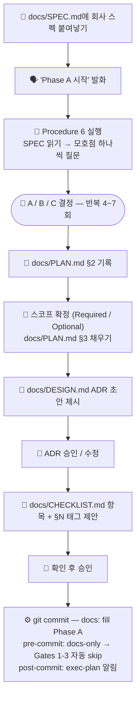
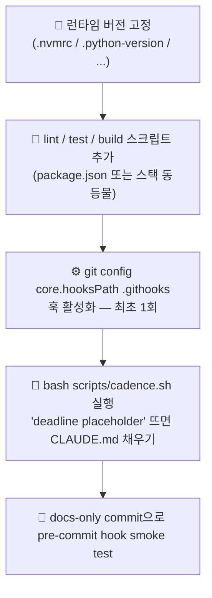
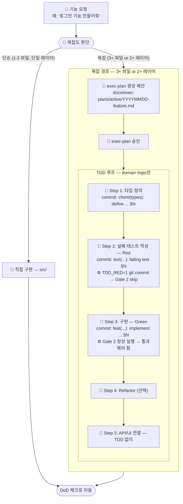
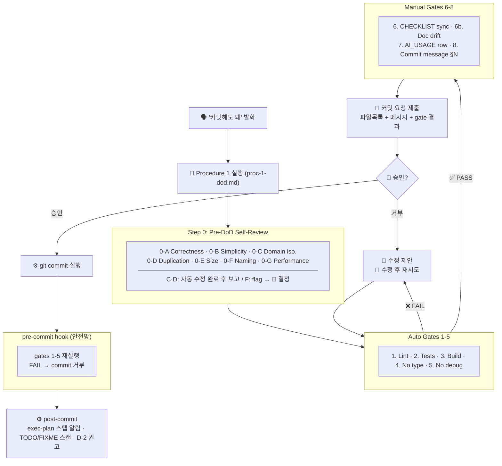
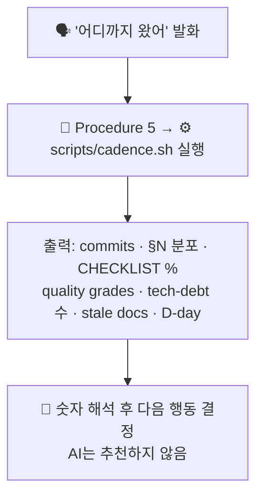
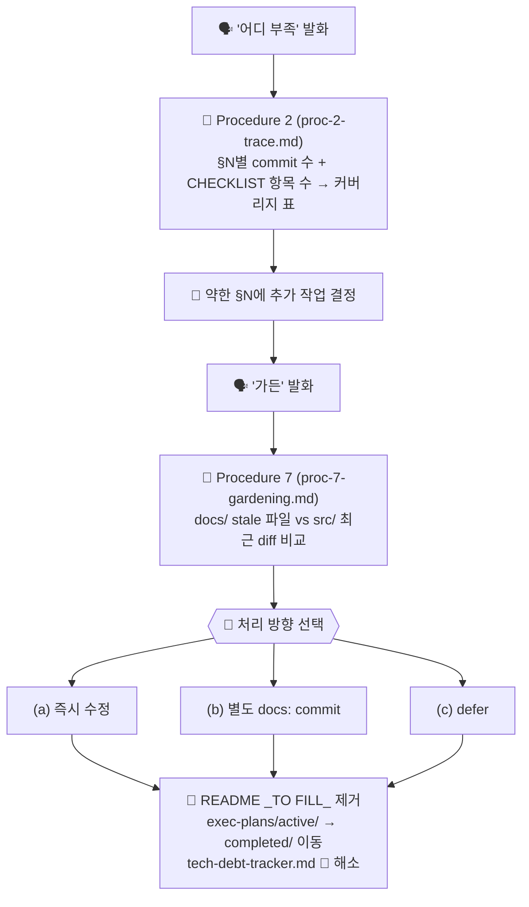
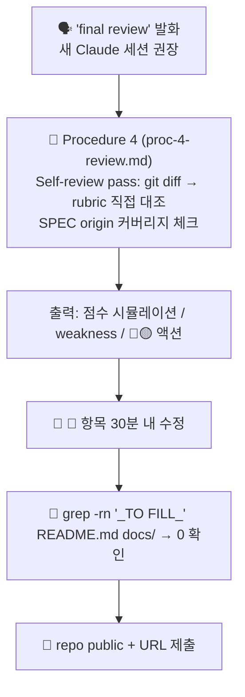

# 작업 가이드 — 지금 어디 있고 다음은 무엇인가

> **대상**: 과제 진행 중 "내가 지금 뭘 해야 하지?"가 헷갈릴 때 참고하는 운영 지도.
> 구조 설명 → [OVERVIEW.md](OVERVIEW.md) / 설계 원칙 → [HARNESS.md](HARNESS.md)

---

## 역할 범례

| 표시 | 의미 |
|---|---|
| 👤 | **사용자 결정 필요** — AI가 대신할 수 없음 |
| 🤖 | **AI 실행** — 트리거 발화 후 AI가 처리 |
| ⚙️ | **자동** — git / script가 개입 없이 실행 |

---

## 상태 1 — Phase A (문서 정렬)

**판단 기준**: SPEC이 없거나 PLAN/DESIGN이 미작성 상태

**→ 완료 기준**: PLAN §2~6, DESIGN ADR 5-10개, CHECKLIST §N 태깅 완료

---

## 상태 2 — Phase B (툴체인 고정)

**판단 기준**: PLAN은 됐는데 lint/test/build 스크립트 미설정

**→ 완료 기준**: lint/test/build 모두 PASS, cadence.sh 정상 출력

---

## 상태 3 — Phase C (구현 루프, ×30-60)

**판단 기준**: 툴체인 준비됨, 기능 구현 중

### 3-A. 기능 시작

### 3-B. 커밋 루프

### 3-C. 진행 상황 확인 (언제든지)

---

## 상태 4 — Phase D (폴리시, D-1)

**판단 기준**: 기능 구현 완료, 마감 1일 전

---

## 상태 5 — Phase E (제출, D-0)

**판단 기준**: 마감 당일, 최종 검토

---

## 빠른 참조 — 트리거 치트시트

| 상황 | 발화 | 실행되는 것 |
|---|---|---|
| 커밋하고 싶다 | `"커밋해도 돼"` | Procedure 1 DoD (self-review + 8 gates) |
| 지금 진행 상황 | `"어디까지 왔어"` | Procedure 5 cadence.sh |
| 약한 §N 찾기 | `"어디 부족"` | Procedure 2 §N trace |
| 코드 품질 점검 | `"코드 리뷰해줘"` | Procedure 8 deep code review |
| 문서 신선도 확인 | `"가든"` | Procedure 7 stale docs |
| 최종 리뷰 | `"final review"` | Procedure 4 strict review |
| SPEC 해석 | `"Phase A 시작"` | Procedure 6 guided fill |
| SPEC 변경됨 | `"SPEC 바뀌었어"` | Procedure 3 drift check |

---

## 사용자 개입이 반드시 필요한 것 (요약)

1. 모든 **커밋 승인** — AI가 절대 자동 commit 불가
2. **SPEC 모호점 A/B/C 선택** — Phase A, Procedure 6
3. **스코프 경계 결정** — Required vs Optional
4. **Quality grades 평가** — 🟢/🟡/🔴 직접 판단
5. **doc-gardening 처리 방향** — (a)/(b)/(c) 선택
6. **TDD_RED commit 승인** — Red phase임을 사용자가 인지
