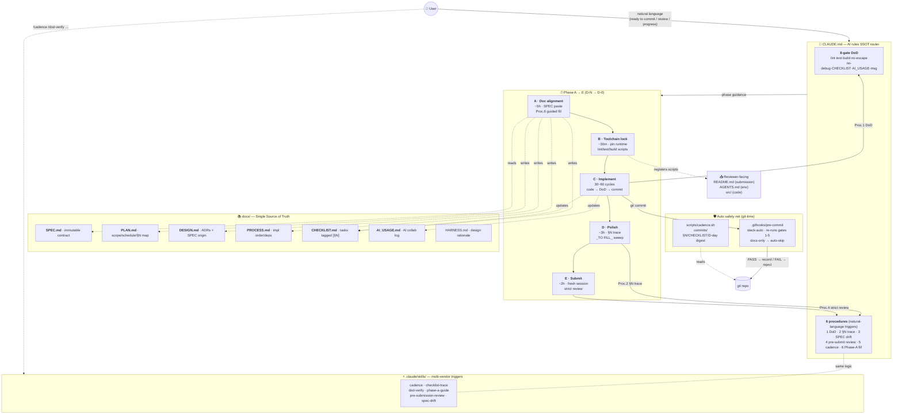
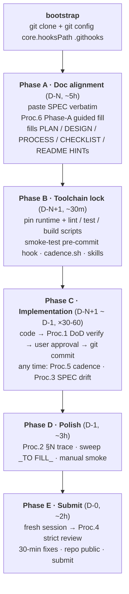
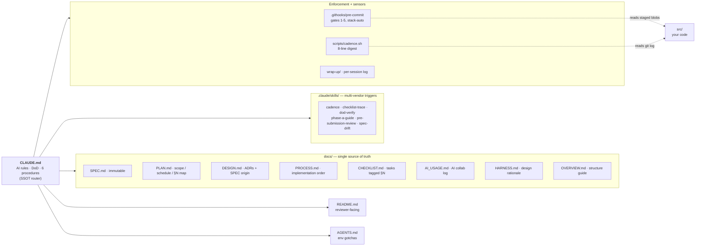
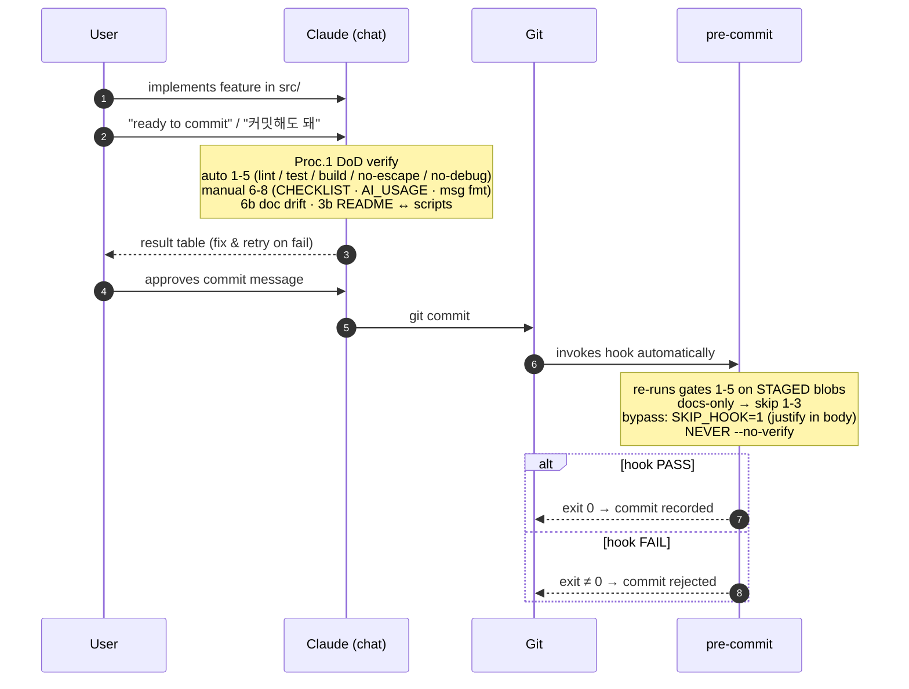

# Overview — How takehome-kit Works at a Glance

> Single-view structure + flow + enforcement. This is the **WHAT** — for the **WHY**, see [HARNESS.md](HARNESS.md).
> Audience: someone who just cloned the kit and wants the full mental model in one page.

---

## Unified diagram



---

## 3-view breakdown

**1. Timeline — Phase A → E sequence**



**2. File map — who owns what**



**3. Per-commit flow — chat-time + git-time double safety net**



---

## Reading guide (3 lines)

1. **Top time-axis** = work order — `A doc align → B toolchain → C implement × N → D polish → E submit`.
2. **CLAUDE.md (center)** = brain — routes natural-language input ("ready to commit", "review", "progress check") into 6 procedures, enforces 8-gate DoD.
3. **docs/ (SSOT)** = single info source · **.claude/skills/** = same procedures exposed to multi-vendor agents (Cursor / Codex / Aider) · **.githooks/pre-commit** = git-time safety net for commits that bypass chat.

---

## Key design properties

| Property | Where it shows up | Why it matters |
|---|---|---|
| **Dual safety net** | Proc.1 DoD (chat-time) + pre-commit hook (git-time) | If user forgets, if AI gets lazy, git refuses |
| **Natural-language triggers** | CLAUDE.md "AI agent procedures" table | No slash commands required — "커밋해도 돼" → Proc.1 |
| **SSOT separation** | CLAUDE.md routing table | Each fact lives in exactly one document; duplicates get consolidated |
| **Multi-vendor reach** | `.claude/skills/SKILL.md` frontmatter | Codex / Cursor / Aider auto-discover via the SKILL.md convention |
| **Read-only observability** | `scripts/cadence.sh` + Procedure 5 | Shows numbers, never recommends — user retains agency |
| **Stack-neutral** | Pre-commit hook auto-detects Node / Python / Rust / Go / Java | One kit, any stack |

---

## File map (flat view)

```
takehome-kit/
├── CLAUDE.md              ← AI rules SSOT (loaded into AI context every turn)
├── README.md              ← Dual identity: kit-readme (initially) → submission-readme (after <details> block removed)
├── AGENTS.md              ← Environment-specific gotchas
├── LICENSE
├── docs/
│   ├── SPEC.md            ← Immutable external contract (paste, then never edit)
│   ├── PLAN.md            ← Our interpretation, scope, schedule, rubric (§N) map
│   ├── DESIGN.md          ← ADRs with SPEC origin field
│   ├── PROCESS.md         ← Implementation order, dependency graph
│   ├── CHECKLIST.md       ← Tasks tagged [§N], per-phase
│   ├── AI_USAGE.md        ← AI collaboration log (rubric requirement)
│   ├── HARNESS.md         ← Design rationale (WHY this kit shape)
│   └── OVERVIEW.md        ← This file (WHAT the kit does)
├── .claude/
│   └── skills/            ← Multi-vendor SKILL.md triggers (pointers to CLAUDE.md procedures)
├── .githooks/
│   └── pre-commit         ← Stack-aware DoD gate enforcement (activated via git config core.hooksPath)
├── scripts/
│   └── cadence.sh         ← 8-line progress digest
└── wrap-up/               ← Per-session work logs (gitignored)
```

---

## See also

- [CLAUDE.md](../CLAUDE.md) — AI rules, DoD definition, 6 procedures (the actual SSOT the AI reads)
- [HARNESS.md](HARNESS.md) — *why* the kit is shaped this way (mapped to OpenAI harness engineering principles)
- [README.md](../README.md) — bootstrap instructions + submission scaffold
