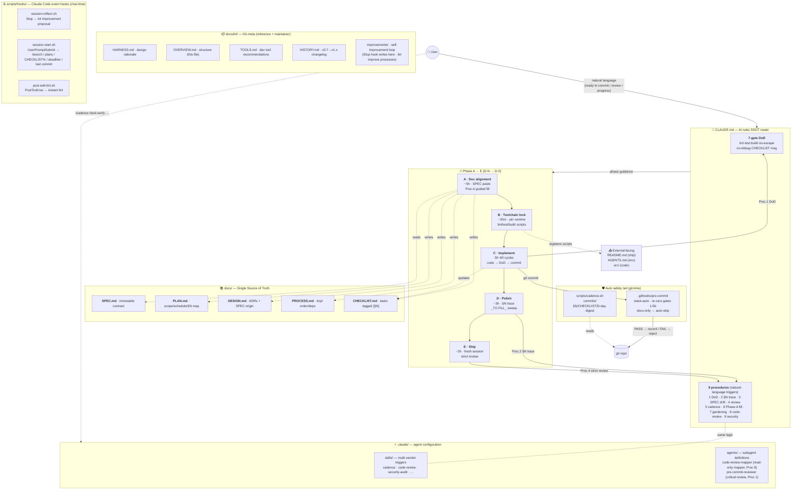
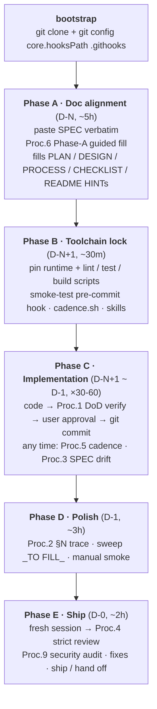
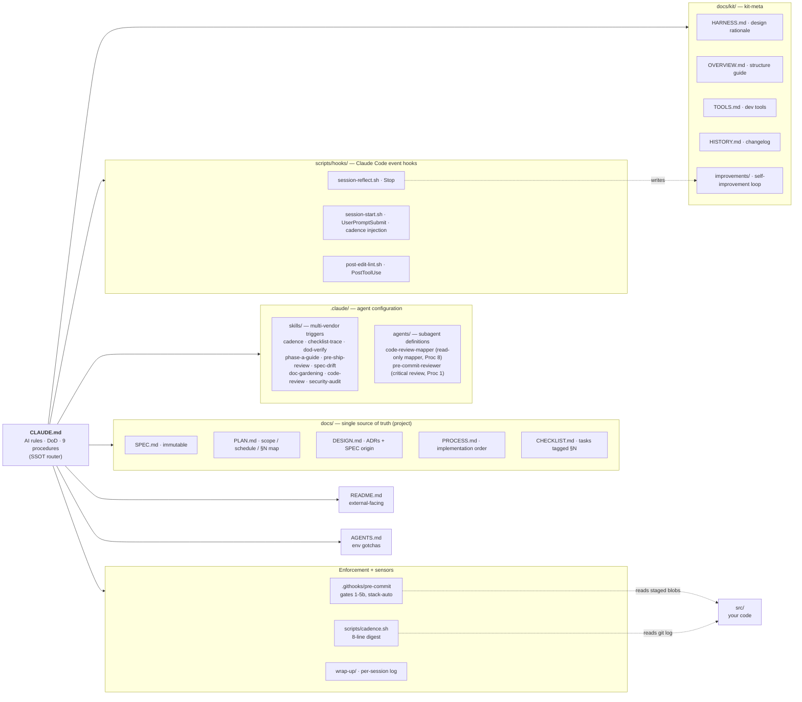
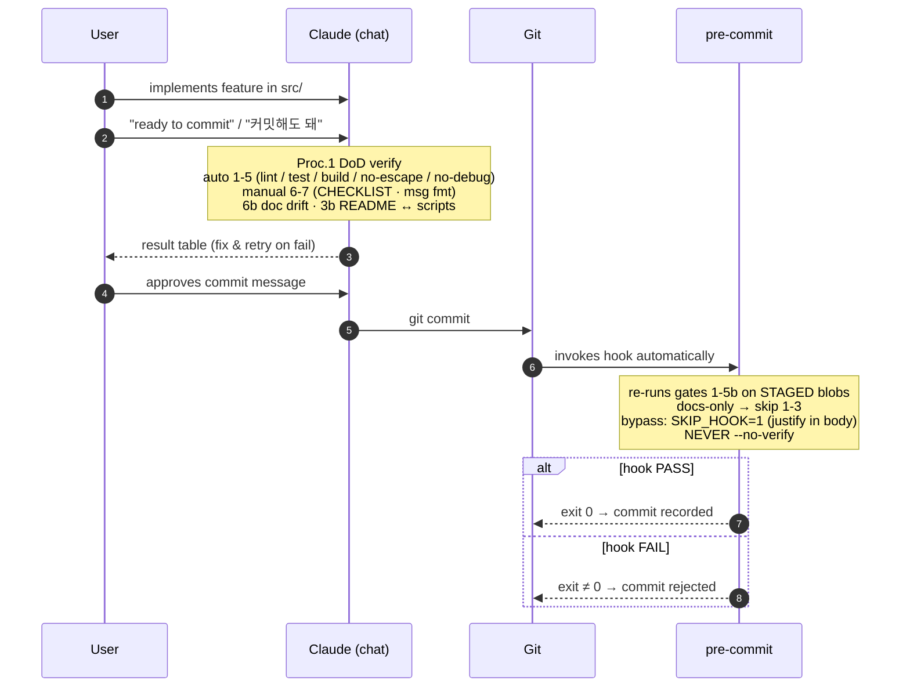

# Overview — How craft-kit Works at a Glance

> Single-view structure + flow + enforcement. This is the **WHAT** — for the **WHY**, see [HARNESS.md](HARNESS.md).
> Audience: someone who just cloned the kit and wants the full mental model in one page.

---

## Unified diagram



---

## 3-view breakdown

**1. Timeline — Phase A → E sequence**



**2. File map — who owns what**



**3. Per-commit flow — chat-time + git-time double safety net**



---

## Reading guide (4 lines)

1. **Top time-axis** = work order — `A doc align → B toolchain → C implement × N → D polish → E ship`.
2. **CLAUDE.md (center)** = brain — routes natural-language input ("ready to commit", "review", "progress check") into 9 project procedures, enforces 7-gate DoD.
3. **docs/ (SSOT)** = project info · **docs/kit/** = kit-meta (reference + maintainer area) · **.claude/skills/** = procedures exposed to multi-vendor agents · **.claude/agents/** = subagent definitions (read-only explorers) · **.githooks/pre-commit** = git-time safety net for commits that bypass chat.
4. **scripts/hooks/** = Claude Code event hooks — chat-time companions: instant lint on edit (PostToolUse), session context injection on start (UserPromptSubmit), and kit self-improvement reflection on stop (Stop) feeding `docs/kit/improvements/` for `kit-improve` review.

---

## Key design properties

| Property | Where it shows up | Why it matters |
|---|---|---|
| **Dual safety net** | Proc.1 DoD (chat-time) + pre-commit hook (git-time) | If user forgets, if AI gets lazy, git refuses |
| **Natural-language triggers** | CLAUDE.md "AI agent procedures" table | No slash commands required — "커밋해도 돼" → Proc.1 |
| **SSOT separation** | CLAUDE.md routing table | Each fact lives in exactly one document; duplicates get consolidated |
| **Multi-vendor reach** | `.claude/skills/SKILL.md` frontmatter | Codex / Cursor / Aider auto-discover via the SKILL.md convention |
| **Subagent exploration** | `.claude/agents/code-review-mapper.md` | Large-scope reviews spawn a read-only subagent to map the subsystem before the main agent edits |
| **Independent critical review** | `.claude/agents/pre-commit-reviewer.md` | Proc 1 Step 0b spawns a fresh-context subagent to check Correctness vs SPEC and Security before every commit |
| **Read-only observability** | `scripts/cadence.sh` + Procedure 5 | Shows numbers, never recommends — user retains agency |
| **Stack-neutral** | Pre-commit hook auto-detects Node / Python / Rust / Go / Java | One kit, any stack |

---

## File map (flat view)

```
craft-kit/
├── CLAUDE.md              ← AI rules index (routing + rules + procedure trigger table + self-improvement loop)
├── README.md              ← Dual identity: kit-readme → project-readme
├── AGENTS.md              ← Environment-specific gotchas
├── LICENSE
├── docs/
│   ├── SPEC.md            ← (Project) Immutable external contract — paste, then never edit
│   ├── PLAN.md            ← (Project) Interpretation, scope, schedule, requirements (§N) map
│   ├── DESIGN.md          ← (Project) §0 Core beliefs + ADRs with SPEC origin field
│   ├── PROCESS.md         ← (Project) Implementation order, dependency graph
│   ├── CHECKLIST.md       ← (Project) Quality grades + tasks tagged [§N] (criterion), per-phase
│   ├── GUIDE.md           ← (Project) Read-this-first walkthrough for new users
│   ├── procedures/        ← (Project) Procedure details — Proc 1-9, read on demand
│   │   ├── proc-1-dod.md
│   │   ├── proc-2-trace.md
│   │   ├── proc-3-spec-drift.md
│   │   ├── proc-4-review.md
│   │   ├── proc-5-cadence.md
│   │   ├── proc-6-phase-a.md
│   │   ├── proc-7-gardening.md
│   │   ├── proc-8-code-review.md
│   │   └── proc-9-security.md
│   ├── exec-plans/
│   │   ├── active/
│   │   │   └── TEMPLATE.md  ← Copy + rename for each complex feature (3+ files)
│   │   ├── completed/       ← Finished exec-plans (history)
│   │   └── tech-debt-tracker.md  ← Running catalog of known shortcuts
│   └── kit/               ← (Kit-meta) About craft-kit itself — reference + maintainer area
│       ├── HARNESS.md         ← Design rationale (WHY this kit shape) — useful reference
│       ├── OVERVIEW.md        ← This file (WHAT the kit does) — useful reference
│       ├── TOOLS.md           ← Recommended dev tools: context-mode + code-review-graph
│       ├── CODING-STYLE.md    ← Coding standard: §1 tool-enforced + §2 judgment rules
│       ├── templates/         ← Copy-at-Phase-B configs
│       │   ├── eslint.config.mjs ← Bucket A/B style rules (layers on eslint-config-next)
│       │   └── .prettierrc       ← Formatter defaults
│       ├── HISTORY.md         ← Kit version history (v0.7 → v1.x changelog)
│       ├── improvements/      ← Kit self-improvement loop — Stop hook writes here (auto-generated)
│       │   ├── kit-improve.md   ← Process for reviewing pending proposals (no number — not a project procedure)
│       │   ├── pending/         ← Auto-generated by Stop hook
│       │   ├── accepted/        ← Archived after kit-improve approves
│       │   └── rejected/        ← Archived after kit-improve rejects (with reason)
│       └── plans/             ← Manual kit planning docs (harness evaluations, initiatives)
│           ├── done/            ← Completed planning cycles
│           ├── in-progress/     ← Active planning cycles
│           └── todo/            ← Queued planning cycles
├── .claude/
│   ├── settings.json       ← Shared hook config: PreToolUse / Stop / UserPromptSubmit / PostToolUse (tracked)
│   ├── settings.local.json ← User-local permissions + additionalDirectories (gitignored — see Component 16)
│   ├── agents/             ← Subagent definitions (code-review-mapper · pre-commit-reviewer)
│   └── skills/             ← Multi-vendor SKILL.md triggers (Codex/Cursor/Aider)
├── .githooks/
│   ├── pre-commit         ← DoD gates 1-5b enforcement (stack-auto, blocks bad commits)
│   └── post-commit        ← Exec-plan sync reminder + inline TODO scan (advisory only)
├── scripts/
│   ├── cadence.sh         ← Progress digest: commits / §N / quality grades / tech-debt / stale docs / D-day
│   └── hooks/             ← Claude Code event hooks (chat-time, complement git-time pre-commit)
│       ├── session-reflect.sh   ← Stop hook  → writes to docs/kit/improvements/pending/ (kit-scoped)
│       ├── session-start.sh     ← UserPromptSubmit → injects branch / active plans / CHECKLIST% / deadline / last commit
│       └── post-edit-lint.sh    ← PostToolUse → instant lint advisory after Write/Edit on src/
└── wrap-up/               ← Per-session work logs (gitignored)
```

---

## See also

- [CLAUDE.md](../CLAUDE.md) — AI rules, DoD definition, 9 procedures (the actual SSOT the AI reads)
- [HARNESS.md](HARNESS.md) — *why* the kit is shaped this way (mapped to OpenAI harness engineering principles)
- [README.md](../README.md) — bootstrap instructions + project scaffold
